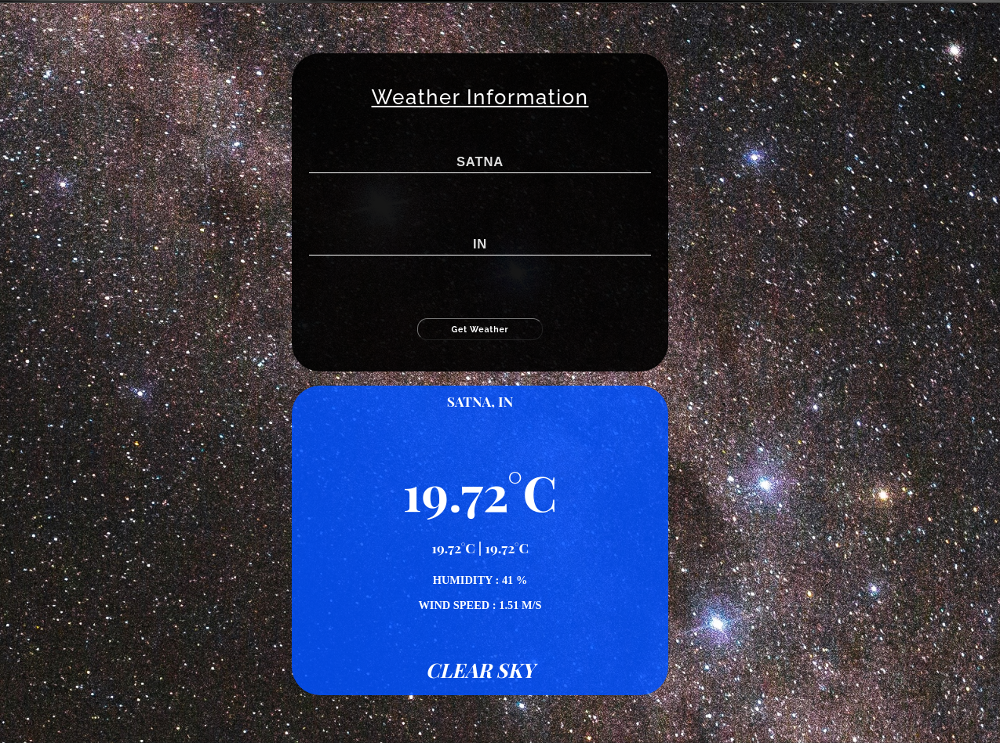

<h1>Weather-app</h1>

[Visit to website](https://apweather.netlify.app/)

### Weather-app is made of ReactJs and also using OpenWeatherMap API to fetch weather forcast for a particular city.

## Required Environment Variables

VARIABLE | Sample value
--- | ---
REACT_APP_API_KEY | Make your own API key from [openweathermap](https://openweathermap.org/)

## Installation Instructions

* Install *Node.js*
* Install *npm*

* Clone this github repo ```https://github.com/gaurav147-star/Weather-app.git``` .
* In the local project directory, create a new file called "`.env`".
* Setup the environment variables as described above.
* Open the local project directory in a terminal, and run: `npm install`.
* npm start .

## Application Screenshots

